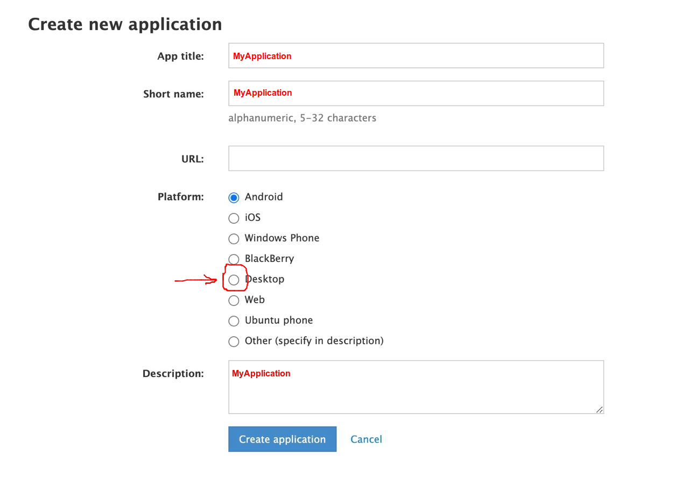

## Report dirty Telegram channels

1. Установите Python 3 (при желании активируйте виртуальное окружение).
2. Установите зависимости:
```bash
pip install -r requirements.txt
```
3. Получите `api_id` и `api_hash` (см. ниже).
4. Поместите ссылки на каналы, которые надо отрепортить, в `dirty_channels.txt` (на каждую строку одну ссылку).
5. Запустите из консоли скрипт в формате
```bash
python3 main.py <api_id> <api_hash>
```
При первом запуске скрипт спросит номер телефона и попросит ввести одноразовый код, который придет в Telegram
для подтверждения аккаунта. При следующих запусках скрипт уже не будут ничего спрашивать.

Пример правильной отработки скрипта:
```bash
$ python main.py 123456 827ccb0eea8a706c4c34a16891f84e7b
Please enter your phone (or bot token): +380XXX
Please enter the code you received: 123456
Signed in successfully as Anonymous
https://t.me/warjournaltg: True
```

###  Как получить `api_id` и `api_hash`
1. Залогиньтесь в https://my.telegram.org.
2. Перейдите в `API development tools` и заполните форму, как показано на экране:


3. Вы получите `api_id` и `api_hash`. В настоящий момент к одному номеру телефона может быть привязан только один `api_id`.
